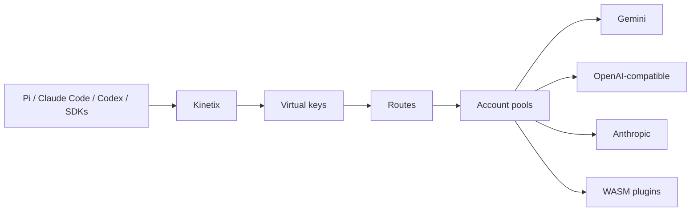

# Kinetix

**Kinetix is a self-hosted LLM gateway for coding agents and small technical teams.**

It exposes OpenAI- and Anthropic-compatible APIs in front of operator-configured LLM providers, with virtual keys, account pools, executable Routes, automatic fallback, usage/cost tracking, and a WebAssembly plugin system.

Everything ships as a single Rust binary with an embedded admin dashboard.

[](https://github.com/PrightCord/kinetix/actions/workflows/ci.yml)
[](https://github.com/PrightCord/kinetix/releases/latest)
[](LICENSE)
[](https://github.com/PrightCord/kinetix/wiki)

## Why Kinetix?

Coding agents and LLM clients usually expect one API endpoint. Real setups often involve multiple providers, accounts, subscriptions, models, quotas, and failure modes.

Kinetix puts them behind one endpoint.

| Capability | Kinetix |
| --- | --- |
| **Client APIs** | OpenAI Chat Completions, OpenAI Responses, Anthropic Messages |
| **Provider adapters** | Gemini, OpenAI-compatible, Anthropic, and plugin-defined adapters |
| **Virtual keys** | Per-client access, limits, budgets, expiry, and model restrictions |
| **Account pools** | Multiple credentials with health, cooldown, quota, and selection strategies |
| **Routes** | Priority, round-robin, weighted, least-used, adaptive routing, and fallback |
| **Streaming-safe fallback** | Retry another eligible target before client-visible response commitment |
| **Plugins** | Sandboxed WASM plugins for adapters, authentication, discovery, routing facts, and probes |
| **Cost tracking** | Token usage, versioned pricing, budgets, cache/thinking-aware accounting |
| **Observability** | Request inspection, Route Trace, diagnostics, usage, and spend |
| **Self-hosted** | SQLite control plane, embedded dashboard, CLI, backups, and exports |
| **Deployment** | Single Rust binary, Docker, systemd, Cloudflare Tunnel |

Kinetix intentionally avoids hardcoded provider presets, pricing catalogs, and guessed model capabilities. Providers, models, credentials, prices, and policies remain operator-controlled.

## How it works



Clients talk to a stable Kinetix endpoint.

Kinetix validates the virtual key, resolves the requested model or Route, selects an eligible target and account, translates the request when necessary, streams the response, and records routing and usage information.

Fallback is only attempted before the response has been committed to the client.

## Quick start

### Install

```bash
curl -fsSL https://raw.githubusercontent.com/PrightCord/kinetix/main/install.sh | bash
```

The installer places `kinetix` in `~/.local/bin` and initializes its local state.

No `.env` file is required for the normal CLI workflow.

### Add a provider

Example using Gemini:

```bash
kinetix provider add \
  --name Gemini \
  --base-url https://generativelanguage.googleapis.com/v1beta \
  --wire-format gemini \
  --auth-scheme custom_header \
  --custom-header-name x-goog-api-key \
  --api-key "$GEMINI_API_KEY" \
  --account-label primary
```

### Add a model

```bash
kinetix model add \
  --provider Gemini \
  --upstream-id gemini-2.5-flash \
  --display-name "Gemini 2.5 Flash"
```

### Create a virtual key

```bash
kinetix key create --name local-client --owner me
```

Client keys use the form:

```text
sk-kinetix-...
```

### Start Kinetix

```bash
kinetix serve
```

Proxy:

```text
http://127.0.0.1:8080
```

Dashboard:

```text
http://127.0.0.1:8080/admin
```

### Send a request

```bash
curl http://127.0.0.1:8080/v1/chat/completions \
  -H "Authorization: Bearer sk-kinetix-..." \
  -H "Content-Type: application/json" \
  -d '{
    "model": "gemini-2.5-flash",
    "messages": [
      {
        "role": "user",
        "content": "Say hello from Kinetix."
      }
    ]
  }'
```

## Client APIs

Kinetix exposes:

```text
POST /v1/chat/completions
POST /v1/responses
POST /v1/messages
GET  /v1/models
GET  /healthz
```

Inference endpoints support streaming and non-streaming operation.

Protocol compatibility and known limitations are documented in [docs/compatibility.md](docs/compatibility.md).

## Pi

Example Pi provider configuration:

```json
{
  "providers": {
    "kinetix": {
      "baseUrl": "http://127.0.0.1:8080/v1",
      "apiKey": "sk-kinetix-...",
      "api": "openai-completions"
    }
  }
}
```

See [docs/pi-compatibility.md](docs/pi-compatibility.md) for compatibility and session-affinity details.

## Routing

A **Route** resolves a requested model into one or more concrete targets.

Supported strategies include:

- priority
- round-robin
- weighted
- least-used
- adaptive

Kinetix tracks account and target health, including rate limits, quota exhaustion, authentication failures, cooldowns, concurrency, and routing telemetry.

Routes can also provide fallback and explicit session-affinity behavior.

Kinetix does not infer conversation identity when the client provides no supported session identifier.

See the [Routing and Fallback](https://github.com/PrightCord/kinetix/wiki/Routing-and-Fallback) documentation for details.

## Virtual keys

Virtual keys allow multiple users, projects, tools, or agents to share one Kinetix deployment without sharing upstream credentials.

Policies can include:

- allowed models and Routes
- RPM limits
- TPM limits
- daily and monthly budgets
- expiry
- allowed IPs
- optional request/response body logging

Virtual-key secrets are displayed once and stored hashed.

## Providers and accounts

A **Provider** defines an upstream service and protocol configuration.

An **Account** provides credentials or another credential strategy for that provider.

Built-in outbound protocols include:

- Gemini
- OpenAI-compatible
- Anthropic

Providers may also use plugins for:

- custom wire adapters
- OAuth and credential strategies
- model discovery
- routing facts
- health and quota probes

Wire format describes protocol behavior. It is not treated as provider identity.

## Plugins

Kinetix supports sandboxed WebAssembly Component plugins using Wasmtime.

Plugins can extend:

- provider adapters
- credential acquisition and refresh
- OAuth flows
- model discovery
- routing facts
- health and quota probes

Plugins run without ambient authority and interact with Kinetix through the versioned WIT contract.

Plugin packages use the `.kxp` format.

Operator documentation is available in [docs/wiki/Plugins.md](docs/wiki/Plugins.md) and the [GitHub Wiki Plugins page](https://github.com/PrightCord/kinetix/wiki/Plugins).

Plugin developers can start with the public contract in [`wit/`](wit/) and the
[plugin SDK, packages, and catalog](https://github.com/PrightCord/kinetix-plugins).

## Dashboard

Kinetix includes an embedded React admin dashboard for managing and inspecting:

- providers and accounts
- models
- Routes
- virtual keys
- plugins
- usage and spend
- request traces
- routing diagnostics
- configuration and exports

The dashboard is served directly by the Kinetix binary.

## Security

Kinetix handles upstream credentials and client API keys.

Relevant protections include:

- encrypted upstream credentials at rest
- hashed virtual-key secrets
- sandboxed WASM plugins
- SSRF protections for configured upstream endpoints
- separate administrator authentication
- request/response bodies disabled from persistence by default
- localhost-only defaults
- dependency and license checks

See [SECURITY.md](SECURITY.md) for the security policy and vulnerability-reporting process.

## Deployment

Kinetix supports:

- native binary
- systemd
- Docker / Docker Compose
- Cloudflare Tunnel
- Cloudflare Access

Production deployment documentation is available in [deploy/README.md](deploy/README.md).

## CLI

The same `kinetix` binary provides both the gateway and administration CLI.

```bash
kinetix status
kinetix doctor

kinetix provider --help
kinetix account --help
kinetix model --help
kinetix route --help
kinetix alias --help
kinetix key --help
kinetix plugin --help
```

See the [CLI Reference](https://github.com/PrightCord/kinetix/wiki/CLI-Reference) for the complete command surface.

## Documentation

The [Kinetix Wiki](https://github.com/PrightCord/kinetix/wiki) contains the main user and operator documentation.

Additional documentation:

- [Architecture](docs/ARCHITECTURE.md)
- [Glossary](docs/GLOSSARY.md)
- [Protocol compatibility](docs/compatibility.md)
- [Pi compatibility](docs/pi-compatibility.md)
- [Benchmarks](docs/benchmarks.md)
- [Deployment](deploy/README.md)
- [Contributing](CONTRIBUTING.md)
- [Security](SECURITY.md)

## Acknowledgements

Kinetix is an independent project, but its development has benefited from studying and testing against other open-source work in the LLM gateway and coding-agent ecosystem.

In particular:

- **[9Router](https://github.com/decolua/9router)** — a useful reference for multi-provider coding-agent routing, OAuth-backed integrations, provider translation, and subscription-oriented workflows.
- **[OmniRoute](https://github.com/diegosouzapw/OmniRoute)** — a useful reference for routing, provider compatibility, translation behavior, and cross-provider edge cases.
- **[pi-free](https://github.com/apmantza/pi-free)** — a useful reference for free-provider integrations and compatibility with the Pi coding-agent ecosystem.
- **[Pi](https://pi.dev/)** — one of the coding-agent environments that motivated Kinetix's focus on streaming, tool use, model portability, routing, and long-running agent sessions.

These projects are references and sources of ideas and compatibility research; Kinetix maintains its own architecture, implementation, and protocol contracts.

Thanks to their maintainers and contributors for making their work available to the community.

## Contributing

Contributions are welcome.

See [CONTRIBUTING.md](CONTRIBUTING.md) for development setup, testing, conventions, and contribution guidance.

For security vulnerabilities, follow the private reporting process in [SECURITY.md](SECURITY.md) rather than opening a public issue.

## License

MIT — see [LICENSE](LICENSE).
