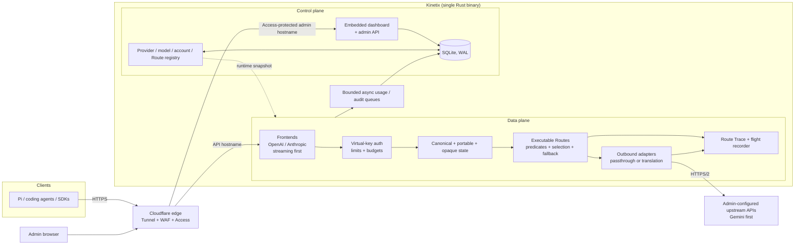

# Kinetix: Multi-Protocol LLM Proxy — Design

## Metadata
- **Author:** Project owner
- **Created:** 2026-09-19
- **Status:** Design (implemented). This document merges the two earlier requirement drafts
  (`kinetix-llm-proxy-requirements-r4.md`, the authoritative revision 4, now removed, and the earlier
  `prism-llm-proxy-requirements.md`, revision 3, also removed) into one design record.
- **Approvers:** none yet

> **Naming.** The product is **Kinetix**. "Prism" was the working name used in the earliest
> revision; it survives here only in historical notes and in the description of what changed.
> The Kinetix branding (`sk-kinetix-` virtual keys, `X-Kinetix-*` response headers) is
> authoritative. Where the old revision says "combo", the current term is **Route**.

## Objective
Give a developer or small technical team one private, self-hosted endpoint for AI coding tools
that speaks the OpenAI Chat Completions and Anthropic Messages formats (streaming first),
forwards requests to administrator-configured upstream LLM APIs (Gemini first), and adds virtual
keys, explainable policy routing, account failover, prompt-cache preservation, cost tracking, and
operational diagnostics without becoming a general AI platform.

## Background
The initial use case is running coding agents such as [Pi](https://pi.dev) against Gemini and
other upstreams through the API formats those clients already support. Directly sharing upstream
API keys gives the team no per-person limits, spend visibility, resilient failover, or independent
revocation.

Kinetix is a single Rust service, deployed on one machine and exposed through a Cloudflare Tunnel.
Clients receive Kinetix virtual keys; upstream credentials never leave the server. A dashboard
embedded in the same binary manages access, providers, accounts, Routes, usage, cost, health, and
diagnostics. (The design revision specifies a Svelte/SvelteKit dashboard; the shipped dashboard is
a React app — a documented deviation, see **Interfaces** and the repository README.)

Kinetix ships **no provider templates or presets**. Every upstream is administrator-defined:
endpoint URL, credentials, wire format, models, optional capabilities, parameters, and prices.
Gemini is the first upstream used for development and acceptance testing but is configured through
the same generic mechanisms as every other provider. User-authored configuration export/import is
supported; Kinetix does not ship official or community provider bundles.

Kinetix keeps internal extension seams for adapters, credential strategies, model sources, and
hooks, but **does not commit to a public plugin runtime or ABI**. A plugin system is a future
product decision only if real integrations cannot be expressed through configuration and the
internal seams. The earlier draft's plugin material (FR-11.3–FR-11.6, NFR-8, and the post-v1
"account-integration plugin" scenario) is retained below as *post-v1, not committed*.

## Related documents
- Pi custom provider docs: <https://pi.dev/docs/latest/custom-provider>
- Repository README, `docs/wiki/`, `docs/compatibility.md`, `docs/pi-compatibility.md`, `docs/benchmarks.md`
- Plugin architecture & specification: `docs/KINETIX-PLUGIN-ARCHITECTURE.md`
- Test plan: the protocol torture suite and compatibility fixtures in FR-9 are part of the
  implementation acceptance criteria.

## Product principles
1. **Coding-agent-first.** Optimize the initial product for developers and small technical teams
   using AI coding tools and multiple model accounts. General-purpose compatibility is useful, but
   it must not dilute coding-agent correctness or operability.
2. **Compatibility before breadth.** A smaller protocol surface implemented correctly is preferred
   over broad approximate compatibility.
3. **Streaming is the normal path.** Long-lived streams, cancellation, incremental events, silent
   thinking periods, and partial failure are first-class behavior.
4. **Preserve information unless a declared policy permits loss.** Canonical, portable-extension,
   and opaque provider state are kept distinct. When opaque state cannot cross a provider boundary,
   Kinetix must either reject the route or strip it with an explicit warning according to configured
   policy; it must never silently destroy it.
5. **Routing must be explainable.** Every candidate, predicate result, skip, attempt, retry,
   fallback, and final selection has a machine-readable reason.
6. **Failure must be ordinary.** Rate limits, quota exhaustion, invalid credentials, outages,
   timeouts, and recovery are explicit states with deterministic handling.
7. **Data plane over control plane.** Dashboard, analytics, alerting, and temporary
   control-plane/database failures must not break already-authorized inference traffic when Kinetix
   has sufficient cached runtime state to continue safely.
8. **Unknown means unknown.** Unknown price, capability, usage, reset time, or metadata is never
   silently replaced with zero, false, or an invented value.
9. **Configuration, not vendor code.** Providers remain declarative whenever technically possible;
   vendor-specific behavior belongs in explicit configuration or wire-format adapters, not hidden
   conditionals.
10. **One machine should feel sufficient.** Avoid distributed infrastructure until the
    single-machine operating model is genuinely inadequate.
11. **The proxy should disappear.** Existing clients should behave as though they were talking to
    their native API except where Kinetix deliberately exposes access-control or diagnostic
    metadata.

The research proposal's original "never destroy information unnecessarily" principle is strengthened
here to encode the chosen cross-provider policy (`reject` or `strip_with_warning`). No principle is
otherwise excluded. The data-plane/control-plane rule is promoted from an implementation detail to
an explicit product invariant.

## Goals
- A developer can point Pi first, and later other coding clients, at Kinetix by changing the base
  URL and API key rather than rewriting the client.
- Streaming chat, tool calls, reasoning-related state, cancellations, usage, and errors behave
  correctly enough for long-running coding-agent sessions.
- Every request is attributable to a person or project, with token counts and cost when knowable.
- Rate-limited, quota-exhausted, unhealthy, or ineligible accounts are handled through executable
  Routes with deterministic fallback before the commit point.
- Provider prompt caches are preserved where possible through cache-aware/sticky routing and
  accurate cached-token accounting.
- Every routing decision is explainable after the fact through a Route Trace without exposing
  internal account topology to ordinary clients.
- Proxy overhead is small, bounded, and independently measurable against a synthetic upstream rather
  than hidden by model latency.
- An admin can issue, limit, and revoke access in seconds without touching upstream credentials.
- Safe to expose on the public internet through a tunnel, with a small trusted team as the intended
  deployment model.
- Any upstream that speaks a supported outbound wire format can be added through configuration with
  only endpoint, credential, wire format, and model ID required.
- The data plane continues serving safely through non-critical control-plane degradation.

## Non-goals
- **General-purpose AI platform.** Kinetix does not optimize for every AI workload; coding-agent
  compatibility is the launch priority.
- **Multi-tenant SaaS.** No billing, self-signup, or hard isolation between mutually distrustful
  customers. Users are a trusted small team.
- **Bundled provider templates, presets, price lists, or community bundles.** Kinetix ships no
  vendor configuration packages. Export/import is strictly user-authored.
- **A committed plugin runtime or public plugin ABI.** v1 guarantees internal seams only. No plugin
  host milestone exists.
- **Privacy-policy routing labels.** Kinetix does not model ZDR/region/proprietary-code policy
  labels in v1. Provider/account allowlists remain available for explicit administrative
  restriction.
- **Guessing capabilities.** Discovery may import what an endpoint reports, but Kinetix does not
  infer undeclared vision, reasoning, tool, or other capabilities.
- **Gemini-native or other inbound formats.** Clients speak OpenAI Chat Completions or Anthropic
  Messages only. Gemini and other supported dialects are outbound formats.
- **Non-streaming as a first-class path.** Non-streaming is a thin aggregation fallback over the
  streaming path.
- **Local response caching in v1.** Exact response caching is removed from committed v1 scope. It
  may be reconsidered later using measured workload data. Semantic response caching remains a
  non-goal.
- **Perfect cross-format equivalence.** Some provider-specific state is inherently non-portable.
  Kinetix makes loss explicit instead of pretending equivalence.
- **High availability.** One instance on one machine. No clustering or multi-region.
- **Prompt management, evals, agent orchestration, semantic routing, or workflow engines.** Kinetix
  moves, translates, routes, and measures requests; it does not build agent workflows.
- **Budget reservation.** v1 enforces budgets without pre-dispatch monetary reservation. Concurrent
  overshoot risk is accepted for now and should be documented operationally.
- **Public compatibility laboratory/certification UI.** Compatibility verification remains an
  internal CI and acceptance-testing concern in v1.

## Scenarios

**Scenario A: Developer runs Pi against Gemini**
1. Admin creates a virtual key `sk-kinetix-...` for Alice, allows the `coder` Route, and sets a
   monthly budget. The full key is shown once.
2. Alice configures Pi with Kinetix's base URL and virtual key using Pi's OpenAI-compatible provider
   type.
3. Pi starts a streaming tool-using session. Kinetix translates requests to Gemini, streams events
   back in the OpenAI format, preserves portable/opaque state according to policy, and records
   usage/cost metadata.
4. Alice disconnects mid-generation. Kinetix promptly cancels the upstream request.

**Scenario B: A Route falls back before commit**
1. Route `coder` has three targets in priority order: a preferred Gemini account, a paid Gemini
   account, and an OpenAI-compatible provider.
2. The preferred account reports quota exhaustion. Kinetix marks it exhausted and records the reason
   in the Route Trace.
3. The paid account returns a retryable 429 before any response bytes reach the client. Kinetix
   places it in cooldown.
4. The third target is eligible and serves the request. The client receives `X-Kinetix-Fallback: 1`
   and an opaque route/request identifier, not the account name.
5. After a preferred account recovers, it becomes eligible again automatically.

**Scenario C: Conditional Route predicates select a target**
1. Admin defines a Route with target predicates: one target is eligible for ordinary tool requests;
   another is eligible when image input is present; another is a long-context fallback when
   sufficient context metadata is known.
2. Kinetix evaluates the typed predicates against known request/configuration facts. Unknown facts
   remain unknown rather than being guessed.
3. Ineligible targets are skipped before connection and the exact predicate result appears in the
   Route Trace.
4. Selection and fallback then proceed among the remaining eligible targets according to the
   Route's configured strategy.

**Scenario D: Every Route target is unavailable**
1. All eligible targets are cooling down, exhausted, disabled, unhealthy, or rejected by
   predicates/capability checks.
2. Kinetix returns a protocol-correct 429 or 503 with `Retry-After` when a recovery time is known.
3. The Route Trace records why every target was skipped or failed; an admin alert fires if the
   configured threshold is met.

**Scenario E: Admin investigates a cost spike**
1. Admin sees that Bob's key used substantially more tokens than usual.
2. Admin filters by key and tag, inspects request metadata, route IDs, serving account internally,
   prompt-cache accounting, latency, and Route Traces, then changes limits if needed.
3. Bob's next request over a configured budget receives a clear 429. Kinetix does not claim stronger
   concurrent-spend guarantees than its non-reservation design provides.

**Scenario F: Admin adds or changes an upstream safely**
1. Admin enters provider name, base URL, wire format, auth scheme, credential, and model ID. Nothing
   vendor-specific is pre-filled.
2. Before Apply, Admin chooses **Validate / Dry Run**. Kinetix validates URL/TLS/SSRF rules, resolves
   the destination, displays resolved IP and ASN when available, verifies credential host binding,
   optionally probes connectivity/model discovery, and reports unknown fields as unknown.
3. For a Route edit, Dry Run simulates predicate/capability eligibility and target ordering without
   sending production traffic.
4. Only a validated configuration snapshot is activated. In-flight requests retain the snapshot with
   which they started.

**Scenario G: Non-portable state crosses providers**
1. A coding-agent conversation contains provider-specific opaque state from the current target.
2. A later request requires fallback to another wire format.
3. If the Route's non-portable-state policy is `reject`, Kinetix rejects the cross-provider attempt
   with a format-correct explanation.
4. If the policy is `strip_with_warning`, Kinetix strips only the identified non-portable state,
   records exactly what was removed in the Route Trace, and emits an explicit client-visible warning
   without leaking infrastructure identity.
5. Silent stripping is never permitted.

**Scenario H: Control plane degrades while streams are active**
1. SQLite writes or the dashboard become temporarily unavailable after Kinetix has loaded a valid
   runtime snapshot.
2. The data plane continues serving already-authorized traffic using cached key/configuration state
   and bounded in-memory usage/diagnostic buffers.
3. Admin mutations fail closed until the control plane is healthy. Buffer saturation is surfaced
   through health/metrics and never causes unbounded memory growth.

**Scenario I: Leaked virtual key**
1. A virtual key is pasted into a public repo.
2. Admin revokes (deletes) it. All subsequent requests with that key fail within seconds. No upstream
   key changes.

**Scenario J: Admin adds an upstream by hand (dashboard flow)**
1. Admin opens Providers → Add. Enters a name, base URL, wire format, the auth scheme, and an
   optional first credential.
2. Admin clicks **Fetch models**. Kinetix calls the provider's model-list endpoint with the
   credential and shows what came back (IDs, plus limits if reported). Admin picks which to import.
3. For each imported model the admin optionally sets capabilities (text, vision, reasoning, tool
   calling), context window, max output, supported parameters (for example a temperature range), a
   thinking-level mapping, and prices. Anything left blank is not sent or not assumed.
4. Admin sends a test request (Test Ping) from the dashboard and sees the upstream status and a
   redacted error if it fails.
5. The model now appears in `/v1/models` for virtual keys allowed to use it, with its configured
   capabilities and limits.

**Scenario K (post-v1, not committed): Admin installs an account-integration plugin**
1. Admin installs a plugin that provides an account-based login for some service and reviews the
   permissions it requests.
2. The plugin registers a new credential strategy or provider type. The admin configures it in the
   same Providers screen as any other upstream.
3. Requests through it get the same virtual keys, limits, budgets, logging, cost tracking, and
   failover as built-in providers. The plugin cannot see other providers' credentials or call the
   admin API beyond what it declared.

## Diagrams

The public API and admin/control surface use separate hostnames through the same tunnel. Runtime
configuration is read into an immutable snapshot used by the data plane. Usage, audit, Route Trace
persistence, and control-plane operations are off the latency-sensitive stream path. There is no
local response-cache node and no plugin-host node in the v1 architecture.

## Glossary
- **Virtual key:** Kinetix-issued credential (`sk-kinetix-...`) given to a user or tool. Maps to
  limits and attribution; distinct from upstream credentials.
- **Upstream credential:** Real provider credential held by Kinetix and never exposed to clients.
- **Account:** One credential for one provider, with health/cooldown/exhaustion state and optional
  soft quota. The unit that gets rate-limited or exhausted.
- **Key pool:** Accounts belonging to one provider and eligible for pool-level selection.
- **Route:** A named routing policy addressable like a model. It contains targets, optional
  eligibility predicates, a selection strategy, fallback triggers, state-portability policy, and
  optional parameter overrides. A Route may span providers and wire formats. *(Renamed from "combo"
  in revision 4.)*
- **Route target:** An account or provider pool plus an upstream model, optional predicate,
  priority/weight, and optional parameter overrides.
- **Route predicate:** A deterministic, side-effect-free condition over Kinetix-known
  request/configuration facts. Predicates are persisted as a typed expression tree rather than
  arbitrary executable code; every evaluation yields true, false, or unknown plus an explanation.
- **Route Trace:** Structured record of candidate generation, predicate/capability decisions,
  account state, attempts, retries, fallback causes, commit status, and final serving target. Full
  topology is admin-visible only.
- **Commit point:** The transition after which Kinetix has begun the client response and may no
  longer retry or splice another upstream response into that request.
- **Frontend:** Inbound API surface in one wire format. v1 offers OpenAI Chat Completions and
  Anthropic Messages.
- **Wire format:** API dialect. Inbound: OpenAI or Anthropic. Outbound: OpenAI-compatible,
  Anthropic, or Gemini.
- **Adapter:** Outbound implementation for one wire format. Chosen by configured wire format rather
  than provider brand, so translation cost grows with the number of formats rather than the number
  of providers.
- **Provider (config):** Admin-defined upstream: name, base URL, wire format, auth scheme,
  credentials, optional headers/timeouts, and models.
- **Model (config):** Admin-defined model with upstream ID plus optional capabilities, limits,
  supported parameters, thinking mapping, and prices.
- **Model discovery:** Optional fetch of the upstream's model list to pre-populate model
  configuration.
- **Capability:** Declared model feature such as text, vision, reasoning, or tool calling. Absence of
  configuration is not automatically evidence of absence in permissive mode.
- **Thinking level:** Kinetix's canonical reasoning-control scale, mapped per model where configured.
- **Credential strategy:** The component that supplies and (in future) refreshes the credentials for
  a provider: a static API key now; a login session or rotating token via a future plugin.
- **Canonical state:** Cross-format request/event information Kinetix models directly: messages,
  tools, sampling, usage, finish state, and other explicitly portable fields.
- **Portable extension:** Information not in the minimal canonical core but modeled so it can survive
  supported translations, such as reasoning, cache hints, images, citations, or structured-output
  metadata where mappings exist.
- **Opaque provider state:** Unknown or provider-specific fields/blocks that Kinetix retains without
  pretending to understand them, such as signed reasoning blocks or provider-specific tool
  identifiers.
- **Passthrough path:** Same-format path that forwards protocol content with minimal transformation
  while still enforcing auth/routing and extracting required metadata.
- **Prompt-cache affinity:** Keeping a conversation on a healthy target when doing so preserves
  provider-side prompt/context caching.
- **Flight recorder:** Bounded metadata-only lifecycle event buffer used to diagnose
  failed/interesting streams without storing prompt/response bodies by default.
- **Data plane:** Request path that authenticates, routes, translates/passes through, streams,
  cancels, and performs bounded accounting work.
- **Control plane:** Dashboard/admin API, configuration persistence, analytics, audit persistence,
  and other operations not allowed to take down the data plane.
- **Alias:** Stable client-facing model name mapped to a direct target or Route.
- **Internal extension seam:** Non-public interface inside the Kinetix codebase for adapters,
  credential strategies, model sources, or hooks. It is not a stable plugin ABI.
- **Plugin (post-v1, not committed):** An installable extension that would add credential
  strategies, providers, or hooks. The core ships no plugin runtime in v1.
- **Pi:** Open-source terminal coding agent and first acceptance client.

## Constraints
- **Language and shape:** Rust backend, embedded dashboard, shipped as one binary with embedded
  assets. *(The design revision names Svelte/SvelteKit; the shipped dashboard is React — see the
  repository README for the documented deviation.)*
- **Hosting:** One machine, reached only through Cloudflare Tunnel; no inbound service port exposed
  directly.
- **Cloudflare behavior:** Long silent streams require SSE keepalives to survive intermediary idle
  timeouts (proxied connections idle ~100 s are dropped with HTTP 524).
- **Upstream:** Whatever the admin configures, under that provider's own terms and quotas. Gemini is
  the first acceptance upstream.
- **No presets:** No default endpoints, model lists, capability guesses, prices, or provider bundles
  are shipped. Minimal working configuration requires endpoint, wire format, credential, and model
  ID only.
- **Team size:** Small trusted team, approximately 5–20 people. Optimize for operational simplicity
  over horizontal scale.
- **Budget:** No required paid managed services beyond chosen ingress/upstream usage.

## Functional requirements

Priority: **MUST** = required for the phase listed; **SHOULD** = planned but can slip; **MAY** =
optional/later. Phases refer to the Timeline.

### FR-1 Inbound API surfaces
| ID | Requirement | Priority | Phase |
|---|---|---|---|
| FR-1.1 | Serve OpenAI Chat Completions (`POST /v1/chat/completions`) with streaming SSE as the primary path. | MUST | 1 |
| FR-1.2 | Serve `GET /v1/models` returning models, aliases, and Routes visible to the calling key, including context/max-output metadata where known. | MUST | 1 |
| FR-1.3 | Serve Anthropic Messages (`POST /v1/messages`) with streaming, including `x-api-key` and `anthropic-version` handling. | MUST | 3 |
| FR-1.4 | Support `stream: false` as a lower-priority fallback by consuming the internal/upstream stream and aggregating it, keeping one behavioral path. | SHOULD | 2 |
| FR-1.5 | Serve OpenAI Responses API (`/v1/responses`) with streaming SSE and non-streaming aggregation. | MUST | 1 |
| FR-1.6 | Serve embeddings endpoints. | MAY | later |

### FR-2 Protocol translation, preservation, and streaming fidelity
| ID | Requirement | Priority | Phase |
|---|---|---|---|
| FR-2.1 | Frontends decode requests/events into an internal representation with three explicit layers: canonical state, portable extensions, and opaque provider state. Adapters consume that representation only when translation is required. | MUST | 1 |
| FR-2.2 | Support system prompts, multi-turn history, sampling parameters, stop sequences, and other canonical fields across supported frontends. | MUST | 1 |
| FR-2.3 | Support tool/function calling end to end: tool definitions, parallel model tool calls, incremental argument streaming, stable tool-call identity where portable, and tool results in later turns. | MUST | 1 |
| FR-2.4 | Support image input (base64 and URL where the selected upstream allows). | SHOULD | 2 |
| FR-2.5 | Map reasoning/thinking controls and output through the portable-extension layer where a configured mapping exists. Do not invent reasoning fields for models without configuration. | SHOULD | 2 |
| FR-2.6 | Map finish reasons, stop reasons, and usage fields correctly in every supported format. | MUST | 1 |
| FR-2.7 | Same-format passthrough is mandatory whenever the corresponding inbound and outbound adapters exist (OpenAI→OpenAI-compatible; Anthropic→Anthropic): preserve original protocol content with minimal parsing/rewriting while still applying auth, routing, cancellation, accounting, and safety checks. OpenAI same-format passthrough ships in Milestone 1 if an OpenAI-compatible outbound path is present there; Anthropic passthrough ships with Anthropic in Milestone 3. | MUST | 1 / 3 |
| FR-2.8 | Unsupported required features return an explicit format-correct error; Kinetix never silently drops behaviorally significant client fields. Cosmetic fields may be ignored. | MUST | 1 |
| FR-2.9 | Client disconnect promptly cancels the active upstream request and records cancellation latency. | MUST | 1 |
| FR-2.10 | Unknown/provider-specific request and response material is preserved as opaque state whenever safely possible. Same-format passthrough must not discard unknown fields merely because Kinetix does not understand them. | MUST | 1 |
| FR-2.11 | When a cross-format/cross-provider attempt cannot carry opaque state, the Route must apply one configured policy: `reject` or `strip_with_warning`. `strip_with_warning` identifies removed state in the Route Trace and emits an explicit client-visible warning; silent stripping is forbidden. The default policy remains an open decision. | MUST | 3 |
| FR-2.12 | Stream parsers and serializers must tolerate arbitrary transport chunk boundaries, including UTF-8/JSON/SSE/tool-argument splits, without changing semantic event boundaries. | MUST | 1 |

### FR-3 Virtual keys and access control
| ID | Requirement | Priority | Phase |
|---|---|---|---|
| FR-3.1 | Admins can create, list, disable, and revoke virtual keys. Full key shown once; only a hash is stored. | MUST | 1 |
| FR-3.2 | Each key has an owner (user or team) and optional free-form tag. | MUST | 1 |
| FR-3.3 | Per-key limits: allowed models, aliases, and Routes; requests/minute; tokens/minute; daily/monthly budget; expiry date. | MUST | 2 |
| FR-3.4 | Optional per-key IP allowlist evaluated against trusted Cloudflare client-IP headers. | MAY | 4 |
| FR-3.5 | Accept virtual keys in frontend-native auth styles (`Authorization: Bearer` for OpenAI-format clients, `x-api-key` for Anthropic-format clients). | MUST | 3 |
| FR-3.6 | Revocation and limit changes take effect within 5 seconds without restart. | MUST | 2 |
| FR-3.7 | Limit violations return a format-correct 429 with a human-readable reason and `Retry-After` where meaningful. | MUST | 2 |

### FR-4 Account health, retries, and commit semantics
| ID | Requirement | Priority | Phase |
|---|---|---|---|
| FR-4.1 | Maintain encrypted upstream credentials/accounts per provider, managed from the dashboard. | MUST | 2 |
| FR-4.2 | Account/pool selection is health-aware and skips disabled, cooling-down, exhausted, or circuit-open accounts. | MUST | 2 |
| FR-4.3 | On classified rate limit, put the account in cooldown, honoring `Retry-After` when available, and allow Route fallback before commit. | MUST | 2 |
| FR-4.4 | On retryable 5xx, timeout, or connection failure before commit, retry/fallback with bounded backoff and attempt/deadline limits. | MUST | 2 |
| FR-4.5 | Implement an explicit request state machine: `SELECT → CONNECT → WAITING_FOR_FIRST_BYTE → COMMITTED → STREAMING/COMPLETE`. The **commit point** occurs when client response bytes/headers that prevent safe replacement have been sent. Retry/fallback is permitted only before commit. | MUST | 1 |
| FR-4.6 | A failure after commit terminates the active stream using the best format-correct error semantics available; Kinetix never silently splices another target into the stream. | MUST | 1 |
| FR-4.7 | Circuit breaker per account with automatic recovery probing. | SHOULD | 2 |
| FR-4.8 | Distinguish account-level failures (rate limit, quota, invalid credential) from request-level failures (invalid request, unsupported required feature). Request-level failures do not trigger fallback. | MUST | 2 |
| FR-4.9 | Emit separate metrics/counters for failures before commit and after commit, plus cancellation latency. | MUST | 2 |

### FR-5 Model aliasing and routing entry points
| ID | Requirement | Priority | Phase |
|---|---|---|---|
| FR-5.1 | Alias table maps client-facing model names to either one direct `(provider, model)` target or a Route. Direct configured models are also addressable as `provider/model-id`. | MUST | 1 |
| FR-5.2 | Admin-configurable aliases may map foreign/hard-coded client model names to Kinetix targets. No vendor aliases are bundled. | SHOULD | 3 |
| FR-5.3 | Unknown model/alias/Route names return a format-correct model-not-found error. | MUST | 1 |

### FR-6 Usage, cost, accounting truthfulness, and logging
| ID | Requirement | Priority | Phase |
|---|---|---|---|
| FR-6.1 | Record per request: timestamp, virtual key, requested model/alias/Route, frontend, status, latency, TTFT, input/output/cached/thinking token counts, computed cost, usage confidence/state, serving account (admin-only), opaque route ID, fallback count, retry count, and commit/failure state. | MUST | 1 |
| FR-6.2 | Extract provider-reported token usage when available. If usage is incomplete (for example aborted stream), record known values and mark missing fields `unknown`; never coerce missing usage to zero. | MUST | 1 |
| FR-6.3 | Compute cost from admin-entered versioned model prices, including distinct cached/thinking rates where configured. Missing price means cost `unknown`, not zero; USD budgets cannot be enforced for unknown-priced usage. | MUST | 2 |
| FR-6.4 | Usage persistence is asynchronous, batched, bounded, and must never block or fail a client request. | MUST | 1 |
| FR-6.5 | Request/response body logging is off by default and opt-in per key, with redaction and short retention. | SHOULD | 4 |
| FR-6.6 | Budget alerts via webhook at configurable thresholds. | SHOULD | 4 |
| FR-6.7 | Append-only audit log for admin mutations. | MUST | 2 |
| FR-6.8 | Accounting state distinguishes at least provider-reported/exact usage, Kinetix-estimated usage (if estimation is explicitly implemented), and unknown. Estimated values must never be presented as provider-reported facts. | MUST | 2 |
| FR-6.9 | Budget checks are performed using settled/known accounting available at dispatch time. v1 does not reserve future spend; documentation and metrics must make possible concurrent overshoot explicit. | MUST | 2 |

### FR-7 Provider prompt-cache preservation
Kinetix does **not** implement a local response cache in committed v1 scope. This section concerns
upstream/provider caching behavior only.

| ID | Requirement | Priority | Phase |
|---|---|---|---|
| FR-7.1 | Preserve and pass through provider-native prompt/context-cache hints and cache-related opaque state whenever the selected format/path permits. | MUST | 2 |
| FR-7.2 | Track provider-reported cached-token usage separately so cost reflects configured cached-token pricing. | MUST | 2 |
| FR-7.3 | Cache-aware sticky routing keeps a session on the same healthy Route target when doing so can preserve provider prompt-cache value; stickiness breaks on ineligibility or configured fallback triggers. | MUST | 2 |
| FR-7.4 | Sticky selection is subordinate to correctness and explicit Route policy: it may not bypass capability checks, account state, access restrictions, or fallback safety. | MUST | 2 |
| FR-7.5 | The exact session-identity mechanism (explicit configurable header, derived conversation hash, or both) remains an open decision; implementation must not guess a conversation identity when evidence is insufficient. | MUST | 2 |
| FR-7.6 | Local exact/semantic response caching is absent from v1 data-path code and dependencies. Reconsideration requires measured workload evidence and a new requirements decision. | MUST | 1 |

### FR-8 Admin dashboard and admin API
| ID | Requirement | Priority | Phase |
|---|---|---|---|
| FR-8.1 | Embedded dashboard served from a separate admin hostname/route group. | MUST | 2 |
| FR-8.2 | Screens: virtual keys; provider/model/account editor; pool/account health; Routes; aliases; usage/cost; request log; Route Trace; failed-stream diagnostics/flight recorder; audit log. | MUST | 2 |
| FR-8.3 | Live view of in-flight/recent requests with status, latency, commit state, fallback state, and token counts. | SHOULD | 4 |
| FR-8.4 | Every dashboard mutation/action is also available through a documented admin HTTP API; dashboard is a client of that API. | MUST | 2 |
| FR-8.5 | Persistent configuration lives in the database or bootstrap configuration and is editable without recompiling. | MUST | 1 |
| FR-8.6 | Provider/model/account/Route edits support **Validate / Dry Run** before Apply. Validation checks schema, endpoint/TLS/SSRF rules, credential-host binding, connectivity when requested, model discovery mapping when requested, missing/unknown price/capability data, and Route predicate/capability eligibility. | MUST | 2 |
| FR-8.7 | Route Dry Run accepts a representative request descriptor and returns candidate ordering, predicate outcomes (`true`/`false`/`unknown`), capability/limit eligibility, account state, and the target that would be selected without mutating production state. | MUST | 2 |
| FR-8.8 | Connectivity validation displays resolved destination IP(s) and ASN when available; unavailable ASN is shown as unknown rather than guessed. | MUST | 2 |

### FR-9 Compatibility and adversarial verification
Compatibility verification is an **internal CI/acceptance capability**, not a public product feature
in v1.

| ID | Requirement | Priority | Phase |
|---|---|---|---|
| FR-9.1 | Fixture suite of recorded/constructed request-response pairs covers plain chat, streaming, tools, parallel tools, reasoning-related state, images, usage, cancellation, errors, and unknown fields for every supported frontend↔outbound-format path. | MUST | 1 |
| FR-9.2 | Acceptance: a Pi multi-turn streaming session with tool use completes through OpenAI format in Milestone 1 and Anthropic format in Milestone 3. | MUST | 1 / 3 |
| FR-9.3 | Maintain checked-in compatibility notes/config for Pi and any additional clients actually exercised by maintainers. This is documentation, not a public certification claim. | SHOULD | 3 |
| FR-9.4 | Protocol torture harness must test 1-byte transport chunks, UTF-8 split across reads, JSON split at arbitrary byte boundaries, tool arguments split character-by-character, interleaved parallel tool calls, reasoning/text interleaving, usage only in final event, zero-token response, unknown fields/content blocks, large tool calls, malformed SSE, upstream disconnect before and after commit, client disconnect, 429 before commit, 5xx/timeout, and at least 120 seconds of silent-thinking keepalive behavior. | MUST | 1 |
| FR-9.5 | Parsers and state machines are fuzz-tested with bounded resource limits; malformed input must fail deterministically without panics or unbounded allocation. | MUST | 1 |
| FR-9.6 | Every regression that changes supported wire output or Route/commit semantics requires a fixture demonstrating the intended behavior. | MUST | 1 |

### FR-10 Provider and model configuration
Principle: no templates. Required inputs are endpoint, wire format, credential, and model ID.
Everything else is optional; **unset means not sent, not assumed, or unknown**.

| ID | Requirement | Priority | Phase |
|---|---|---|---|
| FR-10.1 | Provider config: name, base URL, wire format (`openai`, `anthropic`, `gemini`), auth scheme (bearer header, custom header, or query parameter), credentials, optional static headers, optional timeouts. | MUST | 1 |
| FR-10.2 | Minimal model config: upstream model ID, display name, enabled flag. | MUST | 1 |
| FR-10.3 | Optional model metadata: extensible capabilities, context window, max output tokens, and per-token prices (input/output/cached/thinking). | MUST | 2 |
| FR-10.4 | Admin-triggered model discovery using provider credentials. List path and response mapping may have wire-format defaults and are overridable; import requires explicit admin selection. | MUST | 2 |
| FR-10.5 | Discovery may be manual or scheduled; it never overwrites admin-edited fields. Disappeared models are flagged, not silently deleted. | SHOULD | 2 |
| FR-10.6 | Generation-parameter metadata may declare supported/unsupported fields, ranges/defaults, and client out-of-range policy (`drop`, `clamp`, `reject`). Parameters not configured are forwarded unchanged only where the active path safely permits. | MUST | 2 |
| FR-10.7 | Thinking config provides a canonical level scale plus per-model mapping to upstream request fields. Models with no mapping receive no invented thinking fields. | MUST | 2 |
| FR-10.8 | Per-provider/model static extra request JSON may merge as `set-if-absent` or `override`; unknown client fields follow explicit forward/strip behavior consistent with FR-2 opaque-state requirements. | SHOULD | 2 |
| FR-10.9 | Capability enforcement mode per provider: `permissive` (unknown/unconfigured capability metadata does not itself reject) or `strict` (required but undeclared capabilities reject). | MUST | 2 |
| FR-10.10 | Model-list endpoints expose configured capabilities/limits using frontend conventions and only entries the calling key may use. Unknown metadata stays unknown/omitted. | MUST | 2 |
| FR-10.11 | Admin can run a connectivity/minimal model probe and receive upstream status plus a redacted error. | MUST | 2 |
| FR-10.12 | Export/import provider/model/account/Route configuration as a **user-authored** file; secrets excluded or encrypted. Kinetix ships no provider bundles. | SHOULD | 4 |
| FR-10.13 | Edits are validated before activation, audited, and applied as a new immutable runtime snapshot without restart. In-flight requests finish on their starting snapshot. | MUST | 2 |
| FR-10.14 | All user-supplied outbound destinations, including discovery/probes, obey NFR-3 outbound security controls. | MUST | 1 |

### FR-11 Internal extensibility seams
Kinetix v1 has **no public plugin runtime or ABI commitment**. These interfaces exist so future
integration work does not require rewriting core routing/frontends.

> **Implementation Note:** Post-v1, the WebAssembly Component Model plugin host has been implemented
> as documented in `docs/KINETIX-PLUGIN-ARCHITECTURE.md` and `docs/wiki/Plugins.md`, fulfilling FR-11.5,
> FR-11.6, and NFR-8 through Wasmtime 48 sandboxing, typed WIT capability seams, encrypted KV storage,
> and the `kinetix plugin` CLI and admin API surface.

| ID | Requirement | Priority | Phase |
|---|---|---|---|
| FR-11.1 | Internal interfaces exist for outbound adapter, credential strategy, model source, and request/response hooks; built-in implementations use the same boundaries. | MUST | 1 |
| FR-11.2 | The credential-strategy seam is capable of representing credential refresh/expiry/rotation and health reporting even though v1 only commits to built-in credential strategies. | MUST | 2 |
| FR-11.3 | Internal extension interfaces are explicitly non-stable/private in v1 and may change between releases without third-party compatibility guarantees. | MUST | 1 |
| FR-11.4 | No admin plugin-install surface, manifest format, sandbox runtime, marketplace, or third-party execution path is included in committed v1 scope. | MUST | 1 |
| FR-11.5 *(post-v1, not committed)* | Plugin host: install, enable, disable, and remove plugins from the dashboard. Each plugin has a manifest declaring name, version, provided components, and requested permissions. | SHOULD | 5 |
| FR-11.6 *(post-v1, not committed)* | Plugins run isolated from the core with only declared permissions (network hosts, which providers' credentials, storage namespace); by default they cannot read other providers' credentials or call the admin API. Plugin-provided providers appear in the same registry and get the same keys, limits, budgets, logging, cost tracking, and failover, and can be members of Routes. Install from a local file or URL with hash verification and version pinning; no central marketplace. | MUST (when the host ships) | 5 |

Intended plugin targets (not built): account-based integrations for Claude, ChatGPT, and similar
services. See **Legal considerations** before building any.

### FR-12 Accounts and executable Routes
An **account** is one credential for one provider. A **Route** is a named policy containing targets,
eligibility predicates, selection policy, fallback policy, prompt-cache affinity behavior, and
state-portability policy. Clients address a Route like a model through its Route name or an alias.

| ID | Requirement | Priority | Phase |
|---|---|---|---|
| FR-12.1 | Each account has state (`healthy`, `cooling_down`, `exhausted`, `disabled`, and circuit-open/unhealthy as needed), optional label, optional selection weight/priority, and optional soft quota. | MUST | 2 |
| FR-12.2 | A Route contains one or more targets. Each target identifies an account or provider pool, an upstream model, optional parameter overrides, optional priority/weight, and an optional typed eligibility predicate. | MUST | 2 |
| FR-12.3 | v1 Route predicates are executable. They are deterministic, side-effect-free expression trees supporting boolean composition and comparisons over Kinetix-known request/configuration facts. Predicate evaluation is three-valued (`true`, `false`, `unknown`) and must produce an explanation for Route Trace/Dry Run. Arbitrary code/eval is forbidden. | MUST | 2 |
| FR-12.4 | Predicate facts may include normalized request properties and explicitly configured metadata needed for routing (for example presence of tools/images/reasoning controls, frontend, requested alias/Route, virtual-key tag, known input/context size, and configured target capability/limit metadata). A fact Kinetix cannot establish is `unknown`; predicates must define how `unknown` affects eligibility rather than guessing. | MUST | 2 |
| FR-12.5 | Selection strategies after eligibility filtering: `priority`, `round-robin`, `weighted`, or `least-used`. Sticky/cache-affinity may override ordinary selection only as permitted by FR-7. | MUST | 2 |
| FR-12.6 | Configurable fallback triggers: rate limit, quota exhaustion, retryable 5xx/connection failure, and timeout. Request-invalid/unsupported-feature errors do not trigger fallback. | MUST | 2 |
| FR-12.7 | Rate limit and quota exhaustion are distinct states. Rate limits cause short cooldown; quota exhaustion persists until provider-indicated reset, configured schedule, manual reset, or other explicit recovery evidence. Classification rules are provider-configurable. | MUST | 2 |
| FR-12.8 | Soft per-account quotas (requests/tokens/USD over configured windows) may mark an account exhausted independent of provider reporting. | SHOULD | 2 |
| FR-12.9 | When a preferred higher-priority account recovers, it becomes eligible again automatically; recovery probing is bounded to avoid stampedes. | MUST | 2 |
| FR-12.10 | Routes may mix providers and wire formats. Each attempt maps request state to that target using configured model/parameter/thinking rules and FR-2 portability rules. | MUST | 3 |
| FR-12.11 | Before connection, filter/score candidates using predicates, account health, access restrictions, and known capability/limit constraints. Unknown capability metadata follows provider permissive/strict policy; predicate unknown handling follows the predicate definition. | MUST | 2 |
| FR-12.12 | If every candidate is unavailable/ineligible, return a protocol-correct 429 or 503 naming the client-facing Route (not internal account topology) and `Retry-After` when the earliest recovery is known. | MUST | 2 |
| FR-12.13 | Cross-provider conversation continuity follows FR-2.10/2.11. Route configuration chooses `reject` or `strip_with_warning` for non-portable opaque state; no silent drop is allowed. | MUST | 3 |
| FR-12.14 | **Route Trace:** every request records candidate enumeration, predicate/capability results, skip reasons, selected account/model internally, attempt outcomes, fallback causes, commit point, and final result. | MUST | 2 |
| FR-12.15 | Ordinary responses hide serving-account/provider topology by default. Responses may include `X-Kinetix-Route-Id` (opaque), `X-Kinetix-Fallback` when fallback occurred, and `X-Request-Id`; admins resolve the opaque ID to the Route Trace. | MUST | 2 |
| FR-12.16 | Usage/cost is attributed both to virtual key/project and internally to serving account/target. | MUST | 2 |
| FR-12.17 | Alerts when a Route's preferred target becomes exhausted, all targets are unavailable, or fallback rate exceeds threshold. | SHOULD | 4 |
| FR-12.18 | Cache-aware sticky routing is mandatory per FR-7.3. | MUST | 2 |
| FR-12.19 | A virtual key may restrict which providers/accounts/Routes may serve it; Route evaluation never bypasses those restrictions. | SHOULD | 3 |

### FR-13 Diagnostic flight recorder
| ID | Requirement | Priority | Phase |
|---|---|---|---|
| FR-13.1 | Maintain a bounded metadata-only lifecycle event recorder for failed or diagnostically selected requests. It records events such as request accepted, auth complete, route candidate chosen/skipped, upstream connect/headers/first frame, tool/reasoning event classes, commit, client disconnect, cancellation issued, socket closed, and usage finalized. | MUST | 2 |
| FR-13.2 | Prompt/response content and secrets are excluded by default. Diagnostic payload snippets require the same explicit body-logging opt-in/redaction controls as FR-6.5. | MUST | 2 |
| FR-13.3 | Recorder storage is bounded by count/bytes/time; saturation drops oldest/lowest-value diagnostics rather than blocking the data plane. | MUST | 2 |
| FR-13.4 | Admin request diagnostics correlate flight-recorder events with Route Trace, request ID, timing, and before/after-commit failure state. | MUST | 2 |

## Non-functional requirements

### NFR-1 Performance and efficiency
Initial SLOs are phase gates. Benchmarking uses a controllable synthetic upstream so inference
latency cannot hide proxy overhead.

| ID | Requirement | Target / acceptance criterion |
|---|---|---|
| NFR-1.1 | Added non-streaming processing latency, excluding upstream time | p50 ≤ 5 ms, p99 ≤ 25 ms at the defined reference load |
| NFR-1.2 | Added stream TTFT latency, excluding upstream time | p50 ≤ 10 ms, p99 ≤ 50 ms at the defined reference load |
| NFR-1.3 | Streaming behavior | Forward incremental data without whole-response buffering; bounded per-stream memory, target ≤ 256 KB excluding explicitly bounded diagnostic/request state |
| NFR-1.4 | Reference capacity | 200 concurrent streams and 50 requests/sec sustained on 1 vCPU / 512 MB for the reference workload |
| NFR-1.5 | Idle footprint | ≤ 50 MB RSS, negligible CPU |
| NFR-1.6 | Cold start | Ready to serve ≤ 2 s |
| NFR-1.7 | Async accounting/diagnostics | No request-path blocking on persistence; bounded queues drop/degrade rather than block |
| NFR-1.8 | Synthetic benchmark matrix | CI/release benchmark covers at least 1, 10, 100, 500, and 1,000 concurrent streams and records p50/p95/p99 overhead, TTFT delta, CPU, RSS, allocations/request where measurable, stream throughput, and cancellation latency. The NFR-1.4 reference load is the hard capacity gate; higher levels are required characterization and must show bounded behavior/no corruption or unbounded growth. |
| NFR-1.9 | Path coverage | Benchmark same-format passthrough, OpenAI→Gemini translation, Anthropic→Gemini translation once available, tool-heavy streaming, large contexts, and large incremental tool arguments. |
| NFR-1.10 | Cancellation | Client disconnect produces prompt upstream cancellation; p95 cancellation signal latency target ≤ 100 ms excluding upstream acknowledgement time. |

### NFR-2 Reliability and data/control-plane isolation
| ID | Requirement | Target |
|---|---|---|
| NFR-2.1 | Availability attributable to Kinetix, excluding upstream/Cloudflare outages | 99.5% monthly |
| NFR-2.2 | Auto-restart via supervisor | Recovery ≤ 10 s |
| NFR-2.3 | Graceful shutdown drains streams up to configurable timeout | Default 30 s |
| NFR-2.4 | Data safety | SQLite WAL, scheduled backup, documented restore, versioned migrations |
| NFR-2.5 | Silent-stream keepalive | SSE keepalive comments/events as protocol permits so intermediary idle timeout does not kill valid thinking periods |
| NFR-2.6 | Data-plane priority | Dashboard, analytics, alerting, audit persistence, and ordinary usage-write failure cannot fail an otherwise serviceable inference request. |
| NFR-2.7 | Database/control-plane degradation | With a valid in-memory runtime snapshot, continue already-authorized serving and buffer/drop bounded async records; admin mutations fail closed. A restart that cannot load authoritative configuration may fail startup rather than guess. |
| NFR-2.8 | Fallback bounds | Configurable max attempts; default number of Route targets capped at 5; default total pre-commit fallback deadline 30 s; health-state changes visible within 1 s |
| NFR-2.9 | Commit invariant | No retry/splice after commit under any error path, including timeout, parser failure, circuit transition, or control-plane failure |
| NFR-2.10 | Runtime snapshot consistency | In-flight requests use immutable starting config; new validated config affects only later requests |

### NFR-3 Security
| ID | Requirement |
|---|---|
| NFR-3.1 | Listen on localhost only; `cloudflared` is sole ingress. Client-IP headers are trusted only because direct ingress is unavailable. |
| NFR-3.2 | Admin dashboard/API use a separate hostname protected by Cloudflare Access; Kinetix additionally validates Access JWTs. Virtual API keys cannot call admin endpoints. |
| NFR-3.3 | Virtual keys are high entropy, stored only as cryptographic hashes, compared in constant time, and shown once. |
| NFR-3.4 | Upstream credentials are encrypted at rest with an external master key and never returned by APIs or logs. |
| NFR-3.5 | Secrets and auth headers are redacted from all logs, traces, diagnostics, and client errors. |
| NFR-3.6 | Request-size and per-key/per-IP rate limits protect against abuse; unauthenticated rejection is cheap. |
| NFR-3.7 | Minimize dependencies; pinned lockfile; `cargo audit`/`cargo deny` in CI. |
| NFR-3.8 | Client errors never expose upstream credential identifiers, internal hostnames/account labels, or unredacted upstream bodies. |
| NFR-3.9 | User-supplied outbound destinations are HTTPS by default; loopback/link-local/private/metadata addresses are blocked unless a specific host is explicitly allowed. DNS results are re-checked at connect time against policy to mitigate rebinding. |
| NFR-3.10 | **Redirect default is zero.** Outbound provider/discovery/test requests do not follow redirects unless explicitly enabled for that provider. Every redirect target, if enabled, is revalidated before use. |
| NFR-3.11 | **Credential host binding:** each credential is bound to its configured authorized host(s). Kinetix must never send it to a different host because of redirect, DNS/config mutation, discovery mapping, or fallback. |
| NFR-3.12 | TLS certificate verification is mandatory in normal operation. Disabling verification is possible only in an explicit development mode that is visibly marked and not silently persisted as production-safe. |
| NFR-3.13 | DNS resolution results used for outbound connections/tests are recorded in redacted operational diagnostics; provider Validate/Dry Run shows resolved destination IPs and ASN when available. |
| NFR-3.14 | Provider credentials are write-only through admin API and scoped to the bound provider/host. |

### NFR-4 Observability
| ID | Requirement |
|---|---|
| NFR-4.1 | Structured JSON logs via `tracing`, request ID propagated to clients and upstream calls. |
| NFR-4.2 | Prometheus-format admin-only metrics: request/error rate, latency/TTFT, active streams, account health, Route fallback/skip counts, before/after-commit failures, cancellation latency, prompt-cache token metrics, queue depths, database/control-plane degradation. |
| NFR-4.3 | Route Trace is the primary explanation surface for routing behavior; column-level request logs must link to it. |
| NFR-4.4 | Flight recorder is the primary stream-lifecycle diagnostic surface and must correlate with request/Route Trace IDs. |

### NFR-5 Maintainability and extensibility
| ID | Requirement |
|---|---|
| NFR-5.1 | Frontends, internal state model, Route engine, and outbound adapters are separated. Adding a provider using a supported wire format is configuration-only. |
| NFR-5.2 | Deployable as one binary plus configuration/database; no required Redis/Postgres/worker runtime. |
| NFR-5.3 | Provider/model/account/Route/alias/price/limit edits need no rebuild or restart. |
| NFR-5.4 | Schema migrations are versioned and automatically run with pre-migration backup. |
| NFR-5.5 | Translation/passthrough state machines are fixture-covered; supported wire-output changes fail CI until fixtures are deliberately updated. |
| NFR-5.6 | Internal extension seams remain private and unstable until a separate requirements decision commits to an external extension API. |

### NFR-6 Usability and operability
| ID | Requirement |
|---|---|
| NFR-6.1 | A new team member can be onboarded (key issued, Pi configured) in under 5 minutes from documented steps. No stricter 60-second target is required. |
| NFR-6.2 | Client errors explain actionable state without revealing topology (for example budget exceeded and known reset time). |
| NFR-6.3 | Dashboard usable on laptop and phone-sized screen for health inspection/revocation. |
| NFR-6.4 | Every configuration editor that can change data-plane behavior exposes Validate/Dry Run before Apply. |
| NFR-6.5 | Primary dashboard prioritizes health, active traffic, spend, and actionable warnings over broad charting. |

### NFR-7 Portability and compatibility
| ID | Requirement |
|---|---|
| NFR-7.1 | Linux x86_64 and aarch64; reproducible CI builds. |
| NFR-7.2 | Wire compatibility is defined by fixtures, adversarial tests, and real Pi acceptance sessions, not specification reading alone. |
| NFR-7.3 | CI retains protocol fixtures and fuzz seeds sufficient to reproduce discovered parsing/streaming regressions. |

### NFR-8 Extension safety (post-v1; applies only once plugins ship)
| ID | Requirement |
|---|---|
| NFR-8.1 | Plugins are untrusted by default and run behind an isolation boundary (sandbox or separate process) with capabilities granted explicitly. |
| NFR-8.2 | A crashing, hanging, or slow plugin cannot crash the core or stall unrelated providers: enforced timeouts, resource limits, and a per-plugin circuit breaker. |
| NFR-8.3 | The plugin interface is versioned; the core refuses plugins built for an incompatible major version. |
| NFR-8.4 | Per-call overhead of each plugin is measured and shown in the dashboard; native adapters keep the NFR-1 targets regardless of plugins installed. |
| NFR-8.5 | Plugin actions on credentials and requests are audit-logged, and plugin logs are namespaced and redacted the same way as core logs. |

## Monitoring / alerting
- Alert if all eligible targets of a Route are unavailable beyond the configured threshold, and when
  its preferred target first becomes exhausted.
- Alert if Route fallback rate exceeds a configured threshold.
- Alert if 5xx/error rate attributable to Kinetix or upstreams exceeds the configured threshold.
- Alert if p95 added proxy latency exceeds 100 ms for 10 minutes.
- Alert if bounded usage/diagnostic queues exceed 80% capacity, begin dropping, or persistence
  repeatedly fails.
- Alert when a virtual key crosses configured budget thresholds.
- Alert if scheduled database backup fails.
- Alert if a built-in credential strategy/model-discovery refresh fails repeatedly.
- External uptime probe on `/healthz`; health distinguishes data-plane serviceability from degraded
  control-plane/persistence state.

## Timeline
- **Milestone 1: Correct streaming skeleton.** Pi through OpenAI Chat Completions to Gemini;
  streaming multi-turn conversation with tools; prompt/client cancellation; virtual keys from
  bootstrap config; SQLite usage rows; canonical/portable/opaque internal-state boundaries; explicit
  commit-point state machine; internal extension seams; protocol torture harness and fuzzing from the
  start. Same-format passthrough is mandatory for any same-format outbound adapter included in this
  milestone.
- **Milestone 2: Operable routing service.** Dashboard/admin API; providers/models/accounts;
  executable Routes with predicates, selection and fallback; rate-limit vs quota classification; soft
  quotas; per-key limits/budgets; cost and prompt-cache accounting; cache-aware sticky routing; Route
  Trace; Validate/Dry Run; diagnostic flight recorder; immutable config snapshots; data/control-plane
  degradation behavior; first full synthetic benchmark matrix against NFR-1; audit log. No local
  response cache and no budget reservation.
- **Milestone 3: Anthropic + cross-provider fidelity.** Anthropic Messages frontend; Anthropic
  same-format passthrough; OpenAI-compatible and Anthropic outbound paths as required for
  same-format/cross-provider routing; cross-provider Routes; opaque-state preservation; configured
  `reject`/`strip_with_warning` continuity policy; foreign-model aliases; Pi Anthropic acceptance and
  internal compatibility fixtures. Compatibility remains CI/internal rather than a public
  lab/certification feature.
- **Milestone 4: Operational polish.** Prometheus metrics, budget/health alerts, live request view,
  optional body logging with redaction, per-key IP allowlists, and **user-authored** configuration
  export/import. Exact response caching remains outside committed v1 scope.
- **Later / separate decision:** embeddings, additional inbound protocols, local
  response caching based on measured demand, enterprise auth, multi-instance operation, or any public
  plugin/runtime ABI.

Dates remain intentionally unspecified until Milestones 1–2 provide measured implementation/benchmark
data.

## Interfaces

**Public API (virtual-key auth):**
- `POST /v1/chat/completions` (OpenAI)
- `POST /v1/responses` (OpenAI Responses)
- `GET /v1/models`
- `POST /v1/messages` (Anthropic)
- `GET /healthz`

**Admin API (Cloudflare Access + Kinetix JWT validation, separate hostname):**
- `/admin/keys`
- `/admin/providers`
- `/admin/models`
- `/admin/accounts`
- `/admin/routes`
- `/admin/aliases`
- `/admin/usage`
- `/admin/requests`
- `/admin/requests/{id}/route-trace`
- `/admin/requests/{id}/diagnostics`
- `/admin/audit`
- `/admin/validate` / resource-specific dry-run endpoints
- `/metrics`

> **Implementation deviation.** The shipped admin API is served under `/admin/api/*` (to avoid
> colliding with the SPA's `/admin/<tab>` page routes) and the dashboard is React, not
> Svelte/SvelteKit. See the repository README and `docs/wiki/Admin-API.md`.

**Client-facing response headers added by Kinetix:**
- `X-Request-Id`
- `X-Kinetix-Route-Id` — opaque identifier resolvable only by an admin through logs/admin API
- `X-Kinetix-Fallback: 1` — only when fallback occurred
- Explicit warning metadata/header when a configured `strip_with_warning` portability action
  affected the request; exact protocol-appropriate encoding is defined by frontend compatibility
  tests

Kinetix does **not** expose serving account/provider names in ordinary client response headers by
default.

**Example Pi configuration (illustrative; exact fields follow Pi docs):** provider `baseUrl` points
to the Kinetix API hostname, `apiKey` is a Kinetix virtual key, API mode is OpenAI Chat Completions
initially, and visible models match configured aliases/Routes. See `docs/pi-compatibility.md`.

## Dependencies / infrastructure
- **Language/runtime:** Rust, Tokio.
- **HTTP server:** Axum.
- **HTTP client:** `reqwest` with rustls and HTTP/2 connection pooling.
- **Storage:** SQLite WAL via `sqlx`.
- **Rate limiting:** `governor` or equivalent bounded token-bucket implementation.
- **Frontend:** static assets embedded with `rust-embed` (the design revision says SvelteKit; the
  shipped dashboard is React).
- **Ingress:** `cloudflared` tunnel; Cloudflare Access on the admin hostname.
- **Process supervision:** systemd or container restart policy.
- **Testing:** deterministic synthetic upstream server, protocol torture fixtures, property/fuzz
  tests, benchmark harness.
- **Local response cache:** none in committed v1; no cache library is required for response caching.
- **Plugin runtime:** none in committed v1.

Hard-to-reverse choices: Rust, the canonical/portable/opaque state model, commit semantics, Route
schema/predicate model, SQLite data schema, provider/model config schema, and client-visible protocol
behavior.

## Security
**Trust boundaries:** Internet → Cloudflare → localhost tunnel → Kinetix data/control surfaces →
configured upstreams. Kinetix holds upstream credentials and enforces virtual-key limits and Route
policy.

**Threats considered:**
- *Leaked virtual key:* hashed storage, revocation, per-key limits/budgets, optional IP allowlist,
  alerts.
- *Admin-surface exposure:* separate hostname, Cloudflare Access, JWT validation in Kinetix, no
  virtual-key access to admin API.
- *Upstream credential theft:* encryption at rest, external master key, least-privilege host user,
  strict redaction, credential host binding.
- *Denial of wallet:* budgets, RPM/TPM limits, request-size limits, Cloudflare WAF. Budget reservation
  is intentionally not implemented, so concurrent overshoot remains a documented residual risk.
- *Header/client-IP spoofing:* trusted only because direct service ingress is unavailable.
- *Malformed payload/stream:* strict bounded parsers, torture tests, fuzzing, bounded diagnostics.
- *SSRF / DNS rebinding / malicious redirect:* private/link-local/metadata blocking, connect-time
  resolved-IP recheck, redirects disabled by default, per-hop revalidation if enabled, mandatory TLS
  verification outside explicit dev mode.
- *Credential exfiltration via redirect/config mutation:* credential host binding forbids credential
  use outside authorized host scope.
- *Topology leakage:* client responses use opaque Route IDs rather than serving account/provider
  names.
- *Control-plane failure:* data plane uses immutable cached runtime state and bounded queues; admin
  changes fail closed rather than partially apply.
- *Malicious or buggy plugins (post-v1):* mitigated by isolation, declared permissions, hash-pinned
  installs, and audit logging (NFR-8).

**Out of scope:** hostile insiders with shell/root access to the host; compromise of an upstream
provider; hard multi-tenant isolation.

## Privacy
- Coding-agent prompts/completions can contain proprietary source, credentials, environment data,
  and customer information. Bodies are not stored by default.
- Metadata such as owner, model/Route, tokens, cost, timings, account attribution (admin-only), and
  route decisions may be retained for operations/cost history; purge is configurable.
- Optional body logging is short-lived, admin-restricted, and redacted.
- Provider-side data handling is governed by each configured upstream's terms. Kinetix does not claim
  to infer or certify retention/privacy policy.
- v1 does not implement privacy labels or policy-based privacy routing. Admins control allowed
  providers/accounts/Routes explicitly per virtual key where needed.
- Route Trace and flight recorder must not become backdoors for prompt/response storage; they are
  metadata-only by default.

## Legal considerations
- Confirm for every configured provider that credential pooling/proxy use and account/quota patterns
  comply with current provider terms before team rollout.
- Dependencies should remain license-compatible with the project's chosen license and are checked
  with `cargo deny`.
- Kinetix core ships no consumer-account login integrations or plugin runtime. Any future
  account-based integration requires a separate legal/product decision because consumer subscription
  sharing or automation may violate provider terms.
- Multiple accounts are intended for legitimate resilience/cost ordering, not evasion of provider
  limits or account restrictions.

## Logging
- **Operational logs:** JSON stdout/journald: startup, configuration activation, upstream errors,
  retries, account-state transitions, DNS destinations, control-plane degradation, admin actions.
  Secrets redacted.
- **Usage records:** per-request metadata in SQLite; async/bounded persistence.
- **Route Traces:** structured routing decision records linked to request ID; serving topology
  admin-only.
- **Flight recorder:** bounded lifecycle diagnostics for failed/selected streams; metadata-only by
  default.
- **Audit log:** append-only admin actions.
- **Never logged by default:** virtual keys, upstream credentials, auth headers/query secrets, prompt
  bodies, completion bodies, opaque provider-state payload contents that may contain sensitive
  material.

## Open issues

All open issues raised across both revisions were resolved during the M1–M4 implementation; the
decisions and the evidence behind them are recorded under **Resolved issues** below.

## Resolved issues
- **Product name:** Prism → **Kinetix**, including virtual-key and client-header branding.
- **Primary product focus:** coding-agent-first for developers/small technical teams.
- **Routes:** former Combos are renamed **Routes** and gain executable conditional predicates in v1.
- **Passthrough:** promoted to MUST; same-format preservation ships with the relevant adapters (OpenAI
  where applicable in Milestone 1, Anthropic in Milestone 3).
- **Internal state:** canonical + portable extension + opaque provider state is mandatory.
- **Opaque-state behavior:** cross-provider non-portable state may only be `reject` or
  `strip_with_warning`; silent stripping is forbidden. Default is `strip_with_warning`.
- **Prompt caching:** provider prompt-cache preservation/cache-affinity is prioritized and sticky
  routing is mandatory; local response caching is removed from committed v1.
- **Compatibility productization:** remains internal CI/acceptance only; no public compatibility
  lab/certification UI in v1.
- **Provider bundles:** no official/community bundles; export/import remains strictly user-authored.
- **Plugins:** no committed public plugin runtime/ABI or plugin milestone; internal seams only.
- **Route explainability:** Route Trace required.
- **Privacy routing labels:** not included in v1.
- **Topology headers:** serving account/provider hidden by default; opaque Route ID used instead.
- **Budget reservation:** explicitly not implemented in v1.
- **Flight recorder:** required in Milestone 2.
- **Performance/adversarial tests:** promoted to acceptance criteria.
- **Commit point:** explicit state-machine concept and metrics required.
- **Outbound security:** redirect-zero default, DNS destination diagnostics, IP/ASN display where
  available, credential host binding, and strict TLS verification added.
- **Data/control-plane priority:** explicit product principle and reliability invariant.
- **Onboarding:** existing under-5-minute target retained; no 60-second requirement or dedicated
  Connect screen committed.
- **Configuration safety:** Validate/Dry Run required.
- **Roadmap:** revised around correctness harness → executable routing/operations →
  Anthropic/cross-provider fidelity → operational polish; no plugin milestone or response-cache
  milestone.
- **Sticky-session identity:** explicit configurable client/session header. Kinetix reads
  `X-Kinetix-Session`, `X-Session-Id`, `X-Conversation-Id`, `X-Session-Affinity`, or `session_id`
  and never derives a conversation identity. Evidence: Pi's OpenAI-completions client sends
  `x-session-id` (openrouter affinity format) and, by default, sends no `prompt_cache_key`, so the
  header is the interoperable mechanism.
- **Default non-portable-state policy:** `strip_with_warning` is the default (recorded in the Route
  Trace and surfaced via `X-Kinetix-Warning`); `reject` is available per Route. Silent stripping is
  forbidden in both.
- **Canonical thinking-level scale:** Kinetix models `off | minimal | low | medium | high | xhigh | max`,
  plus an internal `default` state that preserves omitted adaptive effort without inventing a
  model-specific level. Explicit levels execute only when present in each model's `thinking_map`;
  `off` is also model-explicit because some always-on reasoning models cannot disable thinking.
  Manual-budget models use `budget_field`; categorical level/effort models and adaptive models use
  `level_field`, with adaptive mode reserved for providers that require an adaptive-thinking envelope.
  OpenAI `reasoning_effort`, Anthropic manual budgets, and Anthropic adaptive `output_config.effort`
  decode into the same canonical scale; Gemini thought signatures remain preserved as opaque state.
- **Model-discovery response mapping:** wire-format default `models_path` plus an admin override, with
  per-model discovery observations that never overwrite admin edits; Gemini implemented first, then
  OpenAI-compatible.
- **Source of truth for configuration:** database-authoritative after a first-run bootstrap file, with
  user-authored export/import; the runtime serves from immutable validated snapshots and never merges
  sources implicitly.
- **Rate/quota classification and reset evidence:** generic, evidence-based classification — a 429
  with a short retry hint is a rate limit (brief cooldown honoring `Retry-After`), a 429 with a
  long/absent hint or quota wording is quota exhaustion (benched until reset) — not provider-name
  conditionals.
- **Mid-stream error encoding:** OpenAI emits an error object, an explicit `finish_reason: "error"`
  chunk, then `[DONE]`; Anthropic emits a single terminal `error` event with no `message_stop`.
  Kinetix never retries or splices after commit; locked by golden fixtures.
- **Route predicate fact vocabulary:** the implemented set is `has_tools`, `has_images`,
  `has_reasoning`, `frontend`, `requested_alias`/`requested_model`, `requested_route`, `key_tag`,
  `input_tokens`, `target_model(_id)`, `target_provider(_id)`, `target_capability`,
  `target_context_window`, `target_max_output_tokens`; unknown facts remain unknown and every
  predicate is explainable.

## Alternatives considered
- **LiteLLM or similar broad gateway:** mature/provider-rich, but Kinetix intentionally optimizes for
  a smaller single-binary coding-agent gateway with explicit protocol and routing correctness.
- **Cloudflare AI Gateway only:** useful managed gateway capabilities, but Kinetix's core requirement
  remains private self-hosting plus cross-format fidelity, virtual-key enforcement, account-state
  routing, and explicit Route Trace under owner control.
- **Node/TypeScript or Go:** may iterate faster; Rust retained for predictable memory/streaming
  behavior and single-binary deployment. Performance claims must come from Kinetix's reproducible
  benchmark suite rather than language assumptions.
- **Postgres:** unnecessary for the single-machine small-team model; revisit only if multi-instance
  operation becomes a real requirement.
- **Direct Pi→provider integration:** simplest for one user but lacks shared virtual-key control,
  accounting, routing/failover, and centralized revocation across tools.
- **Bundled provider presets/config bundles:** friendlier onboarding but rejected to avoid stale
  vendor knowledge and hidden defaults. Model discovery plus strictly user-authored export/import is
  the chosen compromise.
- **Local exact/semantic response caching:** removed from committed v1 because coding-agent
  conversations are expected to benefit more from upstream prompt-cache affinity. Reconsider only
  from measured hit-rate/value evidence.
- **Public plugin system:** deferred because ABI, isolation, lifecycle, permissions, and compatibility
  create a second product. Internal seams remain so a later decision does not require rewriting core
  request flow.
- **Visual workflow/policy engine:** rejected. Routes use a bounded typed predicate model rather than
  arbitrary workflows or scripts.
